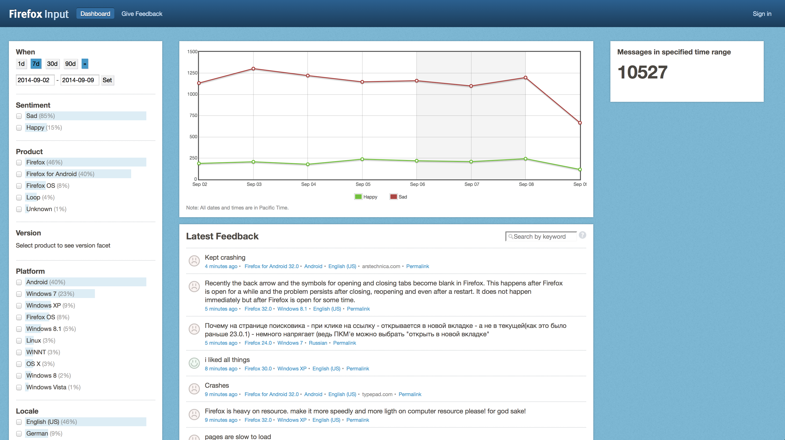

.. intern_presentation documentation master file, created by
   sphinx-quickstart on Tue Sep  9 12:05:13 2014.
   You can adapt this file completely to your liking, but it should at least
   contain the root `toctree` directive.

===============================================
Adding Spice to Fighting Spam
===============================================
Ian Kronquist

muricula on irc.mozilla.org

https://github.com/iankronquist

Spam and Abuse                                                                   
==============
                                                                                   
* Spam and abuse is a problem for user facing Mozilla sites like input.mozilla.org and support.mozilla.org.
* Input responses are used by the User Advocacy Team.
* Sumo is the support forum for Mozilla products.
* Support forum responses are helpful for users of Mozilla products.

What is Spam?
=============

* Spam isn't always the same stuff you get in your email inbox.
* Nor is it necessarily from bots which are looking for backlinks.
* The type of spam Input gets is typically from humans.

An Example of Spam in Input
===========================

We got a bunch of these one day:

.. code-block:: javascript 

    {
    "description": "“The Homosexual Narcissist”
        http://www.youtube.com/watch?v=55Hh7TC1yNs",
    "created": "2014-07-28T05:01:38",
    "locale": "en-US",
    "user_agent": "Mozilla/5.0 (Windows NT 6.1) AppleWebKit/537.36
        (KHTML, like Gecko) Chrome/36.0.1985.125
        Safari/537.36 OPR/23.0.1522.60",
    "happy": false,
    "id": 4537585,
    }, 

Why do People Spam Input?
=========================

* It's hard to say a lot of the time.
* Most of the time spammers just type in some gibberish.
* Sometimes people use it to complain about Mozilla.
* Occasionally we get SQL Injection and XSS fuzzer bots.

Why not Use an Off-the-Shelf Solution?
======================================

* There are lots of products for email spam, but they need a lot of context like email headers.
* There are products for forum spam, but they also often require the context of a user account and previous posts.
* Input responses are very short, come in a variety of languages, and frequently contain misspellings and poor grammar.

My Project: Spicedham
=====================

https://github.com/mozilla/spicedham

* Spicedham is a python library used for classifying user generated responses.
* Spicedham uses a system of pluggable classifiers, tokenizers, backend data stores and is easily extensible.
* Developed primarily for Input.
* Written in python and can be used with or without Django.

Writing a Python Library that Uses Plugins
==========================================

* When I started I used python's `setup.py` entry points, a feature for making plugins for python projects. They're great and easy to use.

.. code-block:: python

    # In your project's setup.py
    setup(                                                                         
        name='plugin',                                                             
        entry_points = 'import.path.to.plugin.file:PluginClass',                   
    )

Unfortunately...
================

* Because of the way we deploy Input those aren't an option.
* So, since all plugins inherit from a class we load all of that class's subclasses.
* This is a hack, but it works. Maybe someday we can move back to using entry points.

.. code-block:: python

    # In the Spicedham library
    def all_subclasses(self, cls):                                                 
        subc = cls.__subclasses__()                                                
        for d in list(subc):                                                       
            sbc.extend(self.all_subclasses(d))                                    
        return subc

Classifying Input Data
======================

* It's easy to write some filters for gibberish and responses which are just random numbers.
* I researched several machine learning methods for classifying user data
    - K nearest neighbors clustering
    - Random forest
    - Bayesian classifier
* The most useful of these is the Bayesian Classifier.

What's a Bayesian Classifier?
=============================

* A Bayesian Classifier assigns probabilities to messages
* It is based on Bayes Theorem, the cornerstone of modern statistics.
* Bayes Theorem relies on using prior knowledge to update a belief about a probability. 

.. figure:: ../_static/seashell.png 
    :align: center
    :scale: 80%

How Does Bayes Theorem Work?
============================
Bayes Theorem states:  
$$p(a|b) = \\frac{p(b|a) \\cdot p(a)}{p(b)}$$
The first symbol is the intersection of the probabilities
$$p(a|b) = p(a) \\cap p(b)$$
Remember, $$p(a|b) \\neq p(b|a)$$

What are the advantages and disadvantages of using this sort of classifier?
===========================================================================

*Pros:*

* A Naive Bayesian Classifier is great for non-numeric data.
* It can easily be implemented easily and is very effective.

*Cons:*

* This type of classifier is inherently stateful and requires a database of training data.
* It can require a large series of training data.
* Training is an expensive one time cost.

How It performs:
================

On training data:

We don't have precise numbers on real data yet, but it's not doing nearly as
well. This is probably due to differences between the training data set and
real data.
